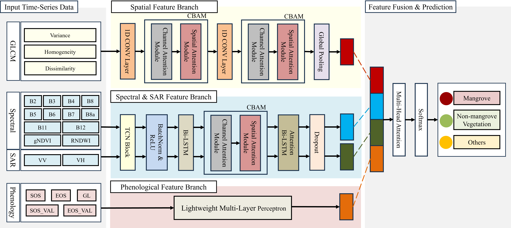
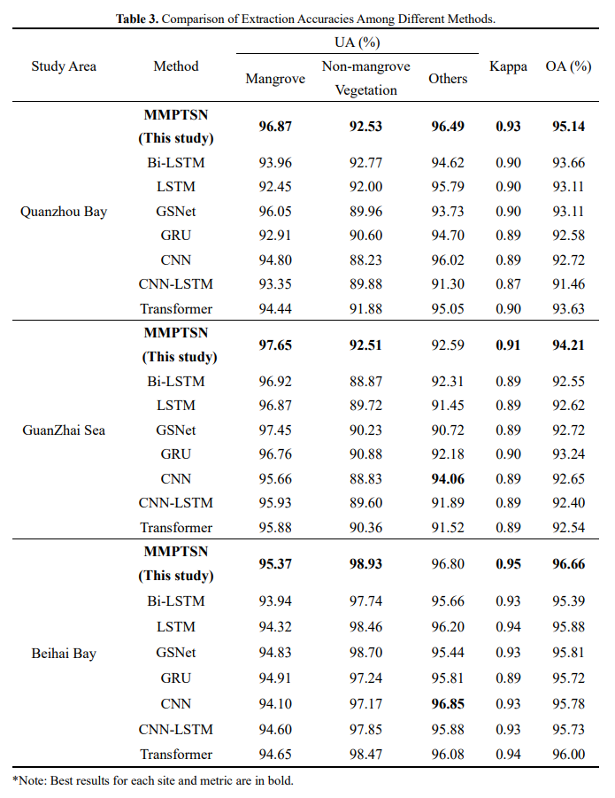

# MMPTSN

Official Pytorch Code base for "Overcoming Spectral and Tidal Challenges in Mangrove Mapping with a Multi-Modal Deep Learning Network Fusing Phenological and Texture Features"

[Project](https://github.com/1van0402/MMPTSN)

## Introduction

This paper developed the Multi-Modal Phenological Temporal-Spatial Texture Network (MMPTSN), a novel deep learning architecture that systematically integrates spectral, SAR, spatial texture, and phenological features from multi-source time-series data. The proposed framework effectively addresses the long-standing challenges of spectral confusion, tidal interference, and suboptimal feature fusion in mangrove mapping.

<p align="center">
  
</p>

<p align="center">
  
</p>

<p align="center">
  
</p>

<p align="center">
  
</p>

<p align="center">
  
</p>


## Using the code:

The code is stable while using Python 3.10.0, CUDA >=11.0

- Clone this repository:
```bash
git clone https://github.com/1van0402/MMPTSN
cd MMPTSN
```

To install all the dependencies using conda or pip:

```
PyTorch
pandas
OpenCV
numpy
gdal
```

## Data Format

Make sure to put the files as the following structure:

```
inputs
└── <train>
    ├── Site A
    |   ├── Train-A.csv
    │   ├── Predict-A.csv
    └── Site B
    |   ├── Train-B.csv
    │   ├── Predict-B.csv
    └── Site C
    |   ├── Train-C.csv
    └── ├── Predict-C.csv
```

## Training and testing

1. Train the model.
```
python train.py
```
2. Evaluate.
```
python test.py
```
3. Prediction.
```
python predict.py
```

If you have any questions, you can contact us: Wenting Wu, wuwt@fzu.edu.cn and Xiaojin Huang, 1543464577@qq.com.

## Dataset
Dataset is provided for scientific use: https://drive.google.com/drive/folders/1WlVMXvKYTKOAqH6cUbkwsyfW-KoOdVZZ?usp=sharing

## Pretrained weight
Pretrained weight file is provided: https://drive.google.com/drive/folders/14HMqAEKAdf_RLzcrsxqIqHHTWFKkOchO?usp=sharing
